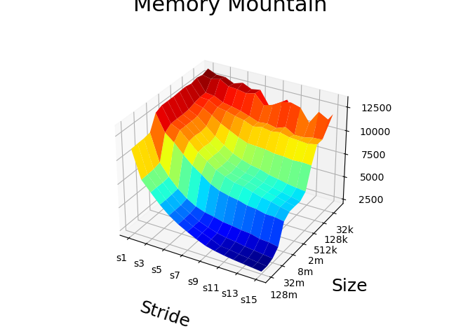

## Brief
This directory contains code for generating a memory mountain, as
described in Computer Systems: A Programmer's Perspective 

clock.{c,h}	- routines for using x86 and Alpha cycle timers
fcyc2.{c,h}	- routines that estimate the number of cycles required 
                  by a function f that takes two arguments.
Makefile	- memory mountain makefile
mountain.c	- program that generates the memory mountain.

## Run
```
make
python graph.py "$(./mountain)"
```

## Result


Model name: Intel(R) Core(TM) i5-10600K CPU @ 4.10GHz

Caches (sum of all):
    L1d: 192 KiB (6 instances)  
    L1i: 192 KiB (6 instances)  
    L2: 1.5 MiB (6 instances)  
    L3: 12 MiB (1 instance)  

## Links
https://onestepcode.com/memory-mountain-cpu-cache/

http://csapp.cs.cmu.edu/3e/students.html

https://medium.com/applied/applied-c-memory-latency-d05a42fe354e

http://igoro.com/archive/gallery-of-processor-cache-effects/
